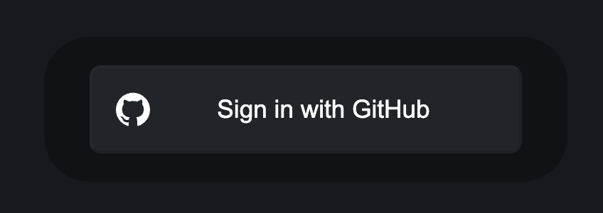

# NextSpace

Playing with NextJS 14 Fundamentals

## Getting Started

First, run the development server:

```bash
npm run dev
```

The codebase covers the following:

- App Router
- Layouts
- Data Fetching
- Streaming
- Static Pages
- API Routes
- Auth.js
- Prisma
- Loading and Error UI
- Client Mutation




